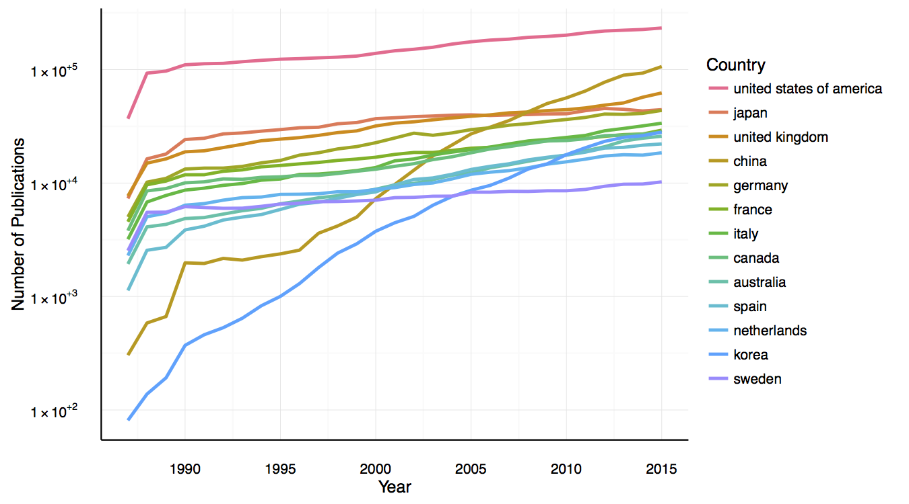

# Affiliation Parser

Fast and simple parser for MEDLINE and Pubmed Open-Access affiliation string.
We can parse multiple fields from the affiliation string including department,
affiliation, location, country, email and zip code from affiliation text.

We also provide function to match affiliation  string to [GRID](https://grid.ac/)
dataset.

## Example

Here is an example to parse affiliation

```python
from affiliation_parser import parse_affil
parse_affil("Department of Health Science, Kochi Women's University, Kochi 780-8515, Japan. watanabe@cc.kochi-wu.ac.jp")
```

output is a dictionary

```python
{'full_text': "Department of Health Science, Kochi Women's University, Kochi , Japan. ",
 'department': 'Department of Health Science',
 'institution': "Kochi Women's University",
 'location': 'Kochi , Japan',
 'country': 'japan',
 'zipcode': '780-8515',
 'email': 'watanabe@cc.kochi-wu.ac.jp'}
```

Here is an example to match affiliation to [GRID](https://grid.ac/) dataset.

```python
from affiliation_parser import match_affil
match_affil("Department of Health Science, Kochi Women's University, Kochi 780-8515, Japan. watanabe@cc.kochi-wu.ac.jp")
```

Output is a dictionary consist of GRID ID

```python
{'City': 'Kochi',
 'Country': 'Japan',
 'ID': 'grid.444150.0',
 'Name': "Kochi Women's University",
 'State': ''}
```

## Dependencies

- [unidecode](https://pypi.python.org/pypi/Unidecode)
- [numpy](http://www.numpy.org/)
- [scikit-learn](http://scikit-learn.org/)

use `pip install -r requirements.txt` in order to install required packages

## Installation

Clone the repository and install using `setup.py` or simple copy `affiliation_parser`
folder to your workspace.

```bash
git clone https://github.com/titipata/affiliation_parser
```

``` bash
python setup.py install
```

## Example results from MEDLINE database

I put some snippet on how to produce quick summarization from MEDLINE data [here](https://github.com/titipata/affiliation_parser/wiki).

**Total number of publications per country**


**Number of publications over time from selected countries**


