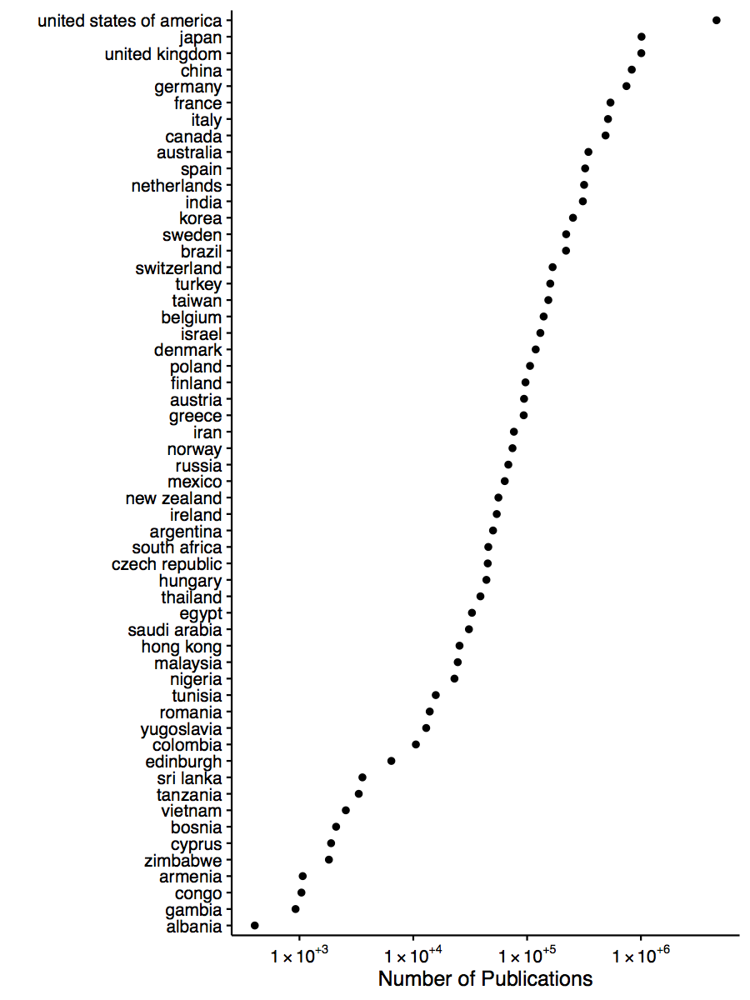

# Affiliation Parser

(work in progress)

Fast and simple parser for MEDLINE and Pubmed Open-Access affiliation string.
We can parse multiple fields from the affiliation string including department, affiliation, location, country, email and zip code from affiliation text.


## Example

```python
from affiliation_parser import parse_affil
parse_affil("Department of Health Science, Kochi Women's University, Kochi 780-8515, Japan. watanabe@cc.kochi-wu.ac.jp")
```

output is a dictionary

```python
{'full_text': "Department of Health Science, Kochi Women's University, Kochi , Japan. ",
 'department': 'Department of Health Science',
 'institution': "Kochi Women's University",
 'location': 'Kochi , Japan',
 'country': 'japan',
 'zipcode': '780-8515',
 'email': 'watanabe@cc.kochi-wu.ac.jp'}
```


## Dependencies

- [unidecode](https://pypi.python.org/pypi/Unidecode)
- [numpy](http://www.numpy.org/)

use `pip install -r requirements.txt` in order to install required packages


## Installation

Clone the repository and install using `setup.py` or simple copy `affiliation_parser`
folder to your workspace.

```bash
$ git clone https://github.com/titipata/affiliation_parser
```

```bash
$ python setup.py install
```

## Example results from MEDLINE database

I put some snippet on how to produce quick summarization from MEDLINE data [here](https://github.com/titipata/affiliation_parser/wiki).


